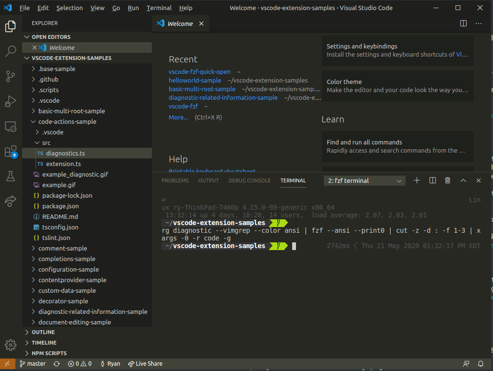

[](https://travis-ci.com/rlivings39/vscode-fzf-quick-open)
[](https://marketplace.visualstudio.com/items?itemName=rlivings39.fzf-quick-open)
[](https://marketplace.visualstudio.com/items?itemName=rlivings39.fzf-quick-open)
[](https://marketplace.visualstudio.com/items?itemName=rlivings39.fzf-quick-open&ssr=false#review-details)

# fzf-based fuzzy searching in VScode to open files/folders and filter ripgrep results
Any time that vscode requires interaction with the OS file dialog, the workflow can become much less efficient. This comes up when opening files outside of your workspace folders or adding a workspace folder. This extension solves that by providing these actions using [fzf](https://github.com/junegunn/fzf).

Provides an interface to search using `ripgrep` and browse the results using `fzf`. This is inspired by Vim's `rg` and `fzf` integration. The search pattern defaults to the word under your cursor or your current selection and is easily overridden.

Works on *nix, Mac, and Windows. Tested with CMD and Git Bash on Windows.

# Usage
Provides the commands:

* `fzf: Search using rg and fzf` to search using `fzf` and `ripgrep`
* `fzf: Open file using fzf` opens a terminal in which you can choose a file
* `fzf: Add workspace folder using fzf` to add a workspace folder

On terminal launch, the `pwd` is chosen based on the active editor file. Also adds

* `fzf: Search in PWD using rg and fzf`
* `fzf: Open file in PWD using fzf`
* `fzf: Add workspace folder from PWD using fzf`

which are the same as above but switches to parent directory of active file on every invocation.

Bind the commands to keyboard shortcuts to launch faster.

## Configuration

Change the setting `fzf-quick-open.initialWorkingDirectory` to override the initial working directory used for the fzf terminal. Change `fzf-quick-open.findDirectoriesCmd` to change the command used to find directories. Something like `fd --type d` is very fast if you use [fd](https://github.com/sharkdp/fd).

By default `fzf` is used as the fuzzy matcher command. To change this to add flags or use another tool like skim (`sk`) modify the setting `fzf-quick-open.fuzzyCmd` to be the command that should be run. It will be plugged in to a context like: `rg searchTerm | fzf --ansi --print0 ...` and needs to support `--ansi --print0` flags.

To change the `rg` case matching options use the setting `fzf-quick-open.ripgrepSearchStyle` to choose between:

* Case sensitive
* Ignore case
* Smart case

# Setup

1. [Install fzf](https://github.com/junegunn/fzf)
1. [Install ripgrep](https://github.com/BurntSushi/ripgrep)
1. For best performance you should set up `fzf` to use the amazingly fast [fd](https://github.com/sharkdp/fd)

    ```fish
    set --universal FZF_DEFAULT_COMMAND 'fd'
    ```

    ```bash
    export FZF_DEFAULT_COMMAND='fd' >> ~/.bashrc
    ```

1. Configure the setting `fzf-quick-open.findDirectoriesCmd` to use `fd`: `fd --type d`

# Examples
**Search with ripgrep**


**Open file**


**Open workspace folder**


